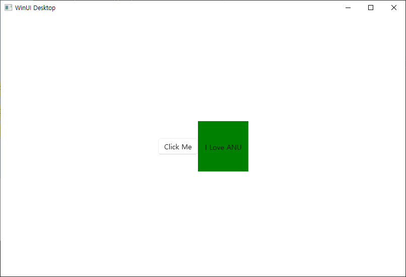

# 231204 비주얼프로그래밍 실습시험 1 BgLabelControl </br>
20191276 컴퓨터공학과 양용석

1. BgLabelControl.idl에서 DependencyProperty 형식의 읽기 전용 정적 속성을 선언</br>
```
// BgLabelControl.idl
namespace BgLabelControlApp
{
    runtimeclass BgLabelControl : Microsoft.UI.Xaml.Controls.Control
    {
        BgLabelControl();
        static Microsoft.UI.Xaml.DependencyProperty LabelProperty{ get; };
        String Label;
    }
}
```
</br>
2. BgLabelControl.h에서 Label 및 LabelProperty 속성을 구현, OnLabelChanged라는 정적 이벤트 처리기를 추가, LabelProperty에 대한 지원 필드를 저장하는 프라이빗 멤버를 추가</br>

```
// BgLabelControl.h
#pragma once
#include "BgLabelControl.g.h"

namespace winrt::BgLabelControlApp::implementation
{
    struct BgLabelControl : BgLabelControlT<BgLabelControl>
    {
        BgLabelControl() { DefaultStyleKey(winrt::box_value(L"BgLabelControlApp.BgLabelControl")); }

        winrt::hstring Label()
        {
            return winrt::unbox_value<winrt::hstring>(GetValue(m_labelProperty));
        }

        void Label(winrt::hstring const& value)
        {
            SetValue(m_labelProperty, winrt::box_value(value));
        }

        static Microsoft::UI::Xaml::DependencyProperty LabelProperty() { return m_labelProperty; }

        static void OnLabelChanged(Microsoft::UI::Xaml::DependencyObject const&, Microsoft::UI::Xaml::DependencyPropertyChangedEventArgs const&);

    private:
        static Microsoft::UI::Xaml::DependencyProperty m_labelProperty;
    };
}
namespace winrt::BgLabelControlApp::factory_implementation
{
    struct BgLabelControl : BgLabelControlT<BgLabelControl, implementation::BgLabelControl>
    {
    };
}
```
</br>
3. BgLabelControl.cpp에서 레이블 텍스트를 설정하는 Label 이라는 Dependency Property를 정의</br>

```
// BgLabelControl.cpp
#include "pch.h"
#include "BgLabelControl.h"
#if __has_include("BgLabelControl.g.cpp")
#include "BgLabelControl.g.cpp"
#endif

namespace winrt::BgLabelControlApp::implementation
{
    Microsoft::UI::Xaml::DependencyProperty BgLabelControl::m_labelProperty =
        Microsoft::UI::Xaml::DependencyProperty::Register(
            L"Label",
            winrt::xaml_typename<winrt::hstring>(),
            winrt::xaml_typename<BgLabelControlApp::BgLabelControl>(),
            Microsoft::UI::Xaml::PropertyMetadata{ winrt::box_value(L"default label"), Microsoft::UI::Xaml::PropertyChangedCallback{ &BgLabelControl::OnLabelChanged } }
    );

    void BgLabelControl::OnLabelChanged(Microsoft::UI::Xaml::DependencyObject const& d, Microsoft::UI::Xaml::DependencyPropertyChangedEventArgs const& /* e */)
    {
        if (BgLabelControlApp::BgLabelControl theControl{ d.try_as<BgLabelControlApp::BgLabelControl>() })
        {
            // Call members of the projected type via theControl.

            BgLabelControlApp::implementation::BgLabelControl* ptr{ winrt::get_self<BgLabelControlApp::implementation::BgLabelControl>(theControl) };
            // Call members of the implementation type via ptr.
        }
    }
}
```
</br>
4. Generic.xaml에서 BgLabelControl 컨트롤 UI를 정의</br>

```
<!-- \Themes\Generic.xaml -->
<ResourceDictionary
    xmlns="http://schemas.microsoft.com/winfx/2006/xaml/presentation"
    xmlns:x="http://schemas.microsoft.com/winfx/2006/xaml"
    xmlns:local="using:BgLabelControlApp">

    <Style TargetType="local:BgLabelControl" >
        <Setter Property="Template">
            <Setter.Value>
                <ControlTemplate TargetType="local:BgLabelControl">
                    <Grid Width="100" Height="100" Background="{TemplateBinding Background}">
                        <TextBlock HorizontalAlignment="Center" VerticalAlignment="Center" Text="{TemplateBinding Label}"/>
                    </Grid>
                </ControlTemplate>
            </Setter.Value>
        </Setter>
    </Style>
</ResourceDictionary>
```
</br>
5. MainWindow.xaml에서 Button부분 다음에 BgLabelControl 인스턴스 추가. (초록색 배경에 Label은 I Love ANU 로 설정)</br>

```
<local:BgLabelControl Background="Green" Label="I Love ANU"/>
```
</br>
6. MainWindow.h에 include문 추가</br>

```

#include "BgLabelControl.h"

```
</br>
실행 화면</br>
</br>
